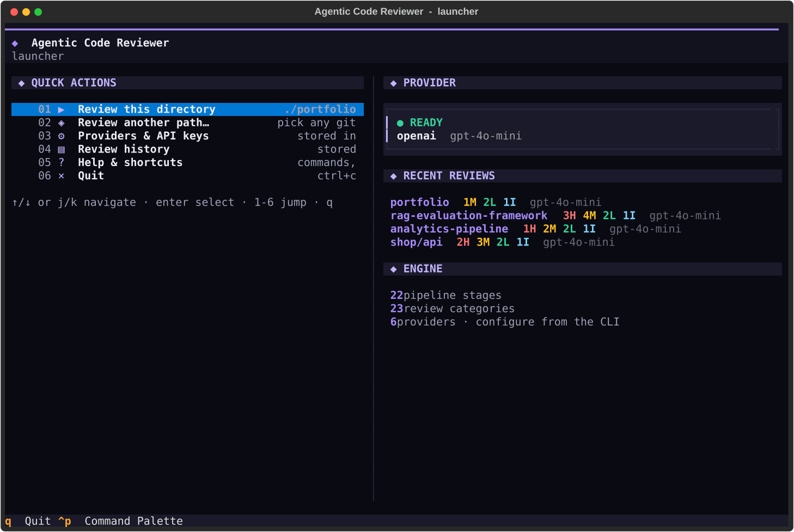
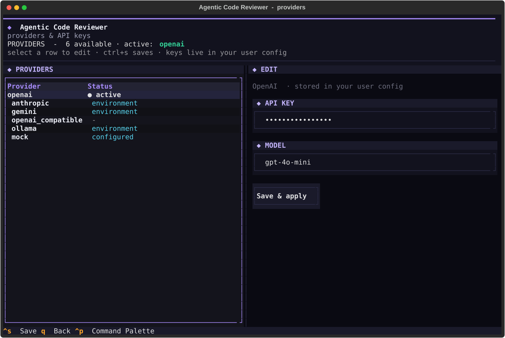
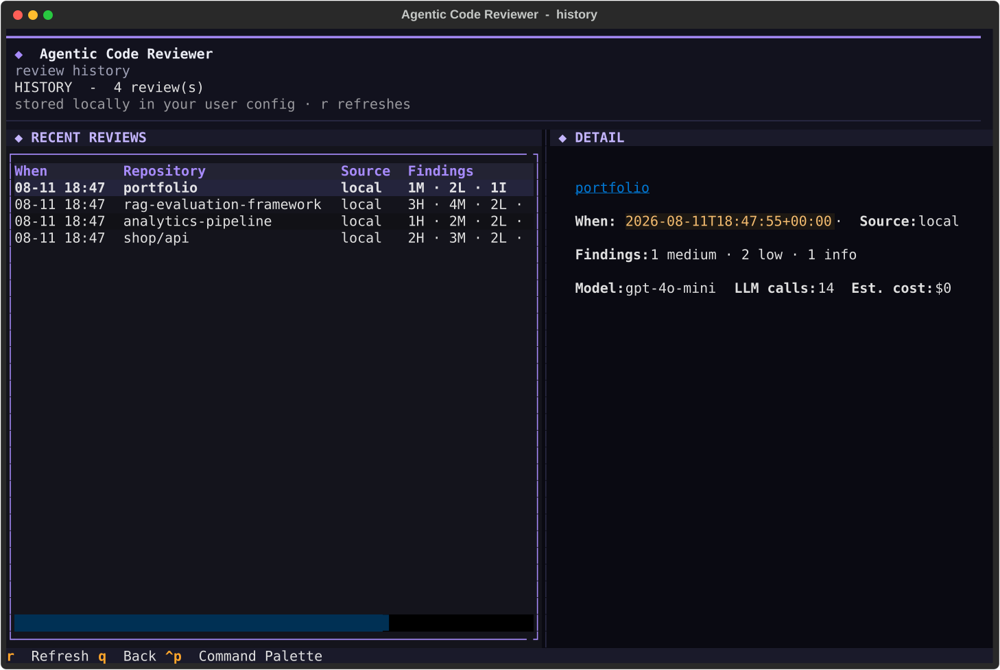
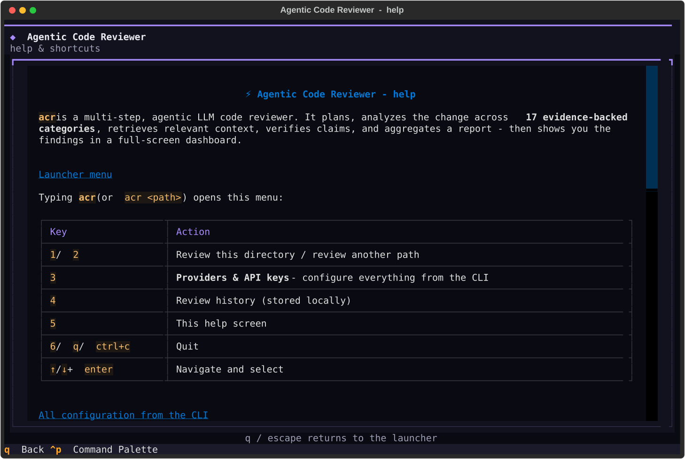
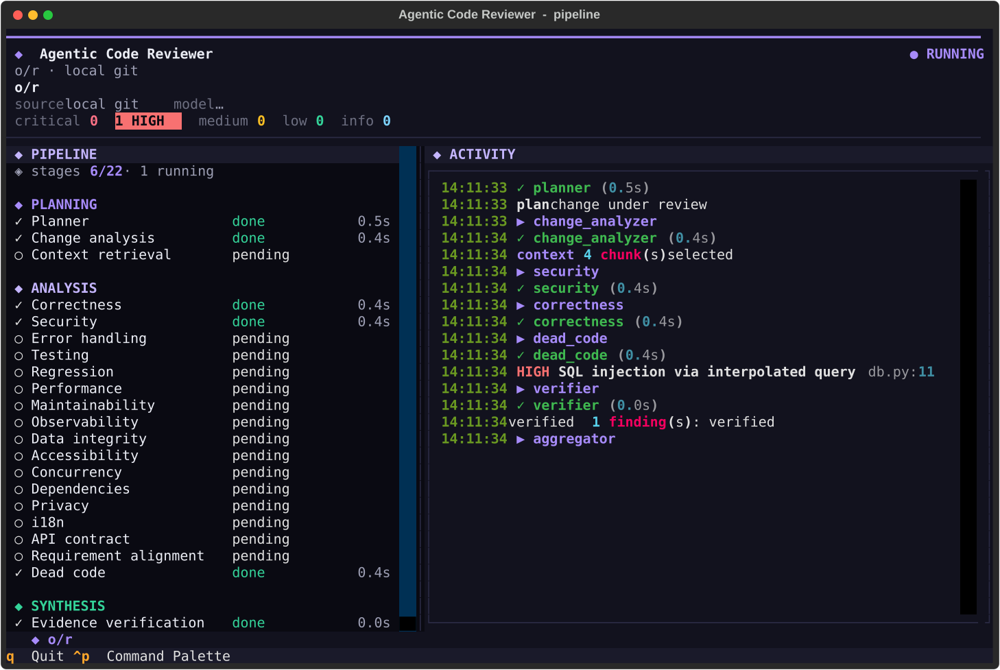
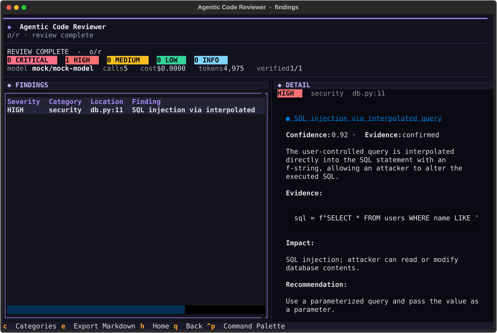
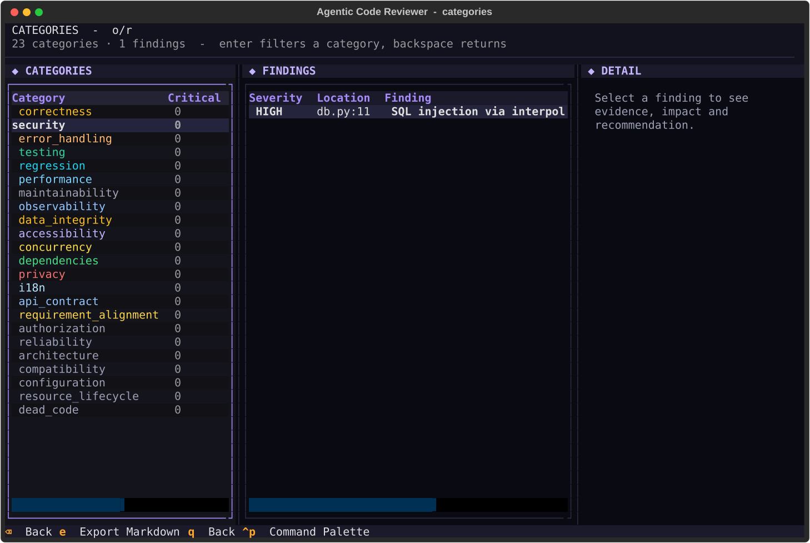
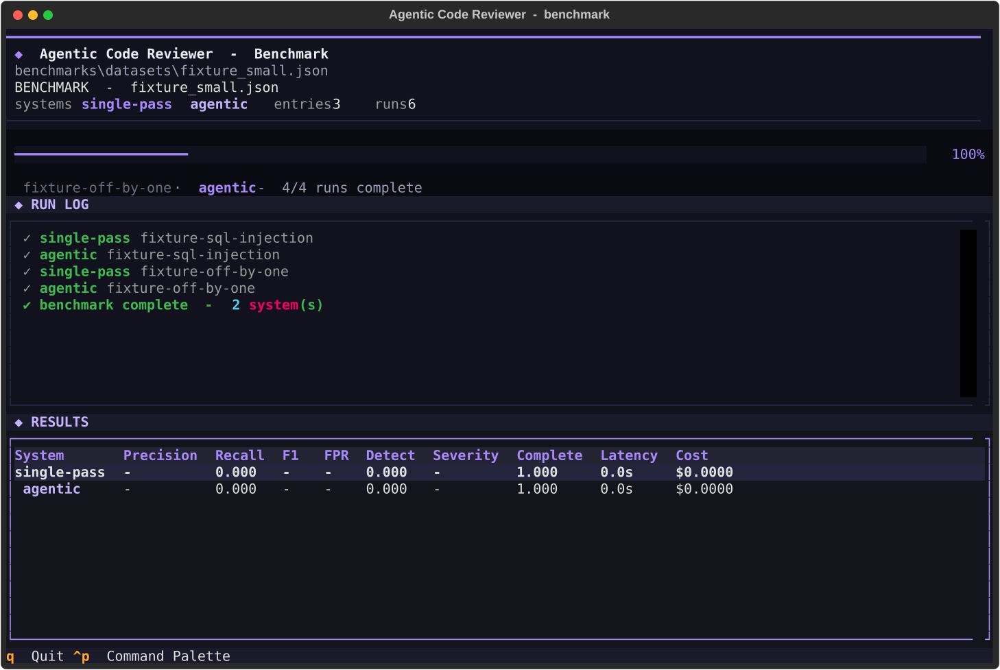

# Agentic Code Reviewer
### Multi-Agent LLM Code Review with Layered Deterministic Verification

<p align="left">
  
  
  
  
  
  
  
</p>

> A production-grade, agentic code reviewer. It analyzes real software changes the way a senior engineer would - planning, targeted repository context, staged analysis across **23 evidence-backed categories**, layered deterministic verification (regex, AST, symbol, taint), and a final aggregated review - then measures whether that agentic approach actually beats single-pass review with a leakage-controlled benchmark. Ships as the `acr` CLI with a full-screen Textual terminal dashboard, works with six LLM providers, and needs no `.env` file: everything is configured from the CLI or the TUI.

---

## Table of Contents

- [The Problem](#the-problem)
- [What This Does](#what-this-does)
- [Key Results](#key-results)
- [The 23 Review Categories](#the-23-review-categories)
- [Verification & Evidence](#verification--evidence)
- [Architecture](#architecture)
- [Repository Structure](#repository-structure)
- [Installation](#installation)
- [Quick Start](#quick-start)
- [Usage (CLI)](#usage-cli)
- [Interactive Terminal Dashboard](#interactive-terminal-dashboard)
- [Providers](#providers)
- [Quality Gates (CI)](#quality-gates-ci)
- [Repository Policy (.reviewer.yaml)](#repository-policy-revieweryaml)
- [Machine-Readable Output](#machine-readable-output)
- [Benchmarking & Evaluation](#benchmarking--evaluation)
- [Development](#development)
- [Configuration Reference](#configuration-reference)
- [Troubleshooting](#troubleshooting)
- [Limitations](#limitations)
- [Related Work](#related-work)
- [Citation](#citation)
- [License](#license)

---

## The Problem

Code review is a verification problem disguised as a language problem. A single LLM call against a diff produces fluent prose with no guarantee any of it is true - findings get invented, lines get cited that were never changed, and there is no mechanism that catches a hallucinated defect before it reaches the developer. Manual review avoids this failure mode but doesn't scale: reading, cross-referencing, and judging every changed line by hand is exactly the high-volume, well-defined cognitive labor automation should be doing.

The core requirement is not "generate findings." It is "generate findings that have been checked."

**Agentic Code Reviewer answers this by never letting a single model both write and grade its own work - every claim is re-verified against the actual repository, the real diff, and the changed lines before it ships.**

---

## What This Does

1. **23 review categories** - 22 LLM analysis agents plus a deterministic dead-code checker that needs no LLM call
2. **Multi-step agentic workflow** - planner, change understanding, parallel category analysis, evidence verification, cross-category synthesis, and aggregation into a final review
3. **Layered deterministic verification** - every LLM finding is checked against regex, AST, symbol, and taint layers and assigned an evidence status: `confirmed`, `strongly_supported`, `insufficient_evidence`, or `rejected`
4. **Lightweight taint analysis** - user-controlled sources are tracked to SQL, shell, filesystem, HTTP, deserialization, and log sinks, with sanitizer and parameterized-query awareness
5. **Shared repository snapshot** - one file / AST / symbol / reference / route / env-var / test index is built per review and queried by every stage, so reviewers never re-read or re-parse files
6. **Cross-category correlation** - overlapping findings are clustered into canonical findings with `primary_category` and `related_categories`; cross-change interactions are detected as materially new defects
7. **Deliberate context, never "dump the repo"** - symbol-aware chunking and semantic retrieval (OpenAI / Gemini / Ollama / OpenAI-compatible embeddings, with a deterministic local TF-IDF fallback) under bounded context budgets
8. **Large diffs handled intelligently** - token-aware decomposition into file groups with per-group parallel analysis and merged findings (no arbitrary truncation)
9. **Interactive terminal dashboard** - a full-screen Textual TUI with a launcher, live pipeline view, severity-coloured findings browser, per-category grouping, and command palette
10. **CI-ready quality gates** - `--fail-on <severity>` exits non-zero when the gate trips; per-repo policy files drive gates for every contributor
11. **Machine-readable output** - JSON and **SARIF 2.1.0** (GitHub Advanced Security / GitLab code scanning / VS Code), with human status on stderr so stdout stays parseable
12. **Six LLM providers** - OpenAI, Anthropic, Google Gemini, any OpenAI-compatible endpoint (vLLM, LM Studio, Groq, OpenRouter, DeepSeek), Ollama locally, and a deterministic mock for tests
13. **Reproducible benchmark harness** - single-pass vs context vs RAG vs agentic systems compared under identical conditions, with leakage-controlled datasets
14. **Secure by design** - repository content is treated as untrusted data (prompt-injection defenses), reviewed application code is never executed, and secrets are never logged

---

## Key Results

> **380 tests passing, ruff clean, mypy clean across 91 source files, and a fully offline test suite - provider calls are transport-mocked and workflow/UI tests run against deterministic mock clients.**

| Signal | Value |
|---|---|
| Review categories | 23 (22 LLM agents + deterministic dead-code) |
| Evidence statuses | confirmed / strongly_supported / insufficient_evidence / rejected |
| LLM providers | 6 (OpenAI, Anthropic, Gemini, OpenAI-compatible, Ollama, mock) |
| Output formats | Markdown, JSON, SARIF 2.1.0 |
| Benchmark systems | single-pass, context, rag, agentic |
| Test suite | 380 passing, fully offline |
| Runtime execution of reviewed code | never |

An honest benchmark: metrics are empty until experiments actually run - nothing is fabricated. Run `acr benchmark` (keyless with the mock provider) to reproduce the full harness yourself.

---

## The 23 Review Categories

The reviewer judges a change across **23 evidence-backed categories**. All share the same hard rules: concrete evidence tied to a changed line, severity `critical → info`, confidence in [0, 1], and style preferences are never reported.

| Category | What it checks |
|---|---|
| Correctness | wrong conditions / off-by-one, missing null handling, state transitions, API misuse, resource leaks |
| Security | injection, XSS, auth bypass, secret exposure, unsafe subprocess/deserialization, weak crypto, SSRF, path traversal, prompt-injection risks |
| Error handling | uncaught/swallowed exceptions, retry/timeout gaps, resource leaks on error paths, partial failures |
| Testing | coverage of changed behaviour (happy path, empty, invalid, boundary, failure), negative/boundary cases, tests that mirror buggy logic, skipped/empty tests |
| Regression | changed/removed APIs & defaults, changed error semantics, silently-broken callers |
| Performance | algorithmic regressions, N+1 queries, blocking calls in async paths, unbounded caches |
| Maintainability | material risks only: dead/duplicated logic, god functions, leaked abstractions |
| Observability | swallowed errors with no log/metric, invisible production failure paths |
| Data integrity | migrations breaking existing rows, missing validation, serialization compat, partial writes |
| Accessibility | frontend changes: missing labels/alt, keyboard operability, focus traps, colour-only meaning |
| Concurrency | races, check-then-act, mutation during iteration, async pitfalls, lock ordering |
| Dependencies | new/upgraded deps, unpinned or `latest`/`*` ranges, lockfile/manifest drift, unjustified new attack surface |
| Privacy | PII in logs/errors/analytics, missing audit trails, sensitive data exposed without justification |
| i18n | hardcoded user-facing strings, locale/timezone formatting assumptions, translation-breaking concatenation |
| API contract | breaking signature/export/data-shape changes with real consumers (external or in-repo callers) |
| Requirement alignment | does the diff satisfy the stated intent? scope creep, named acceptance criteria unmet - only runs when a requirement is provided |
| Authorization | IDOR/BOLA, missing ownership checks, privilege escalation, tenant isolation, missing auth on new routes |
| Reliability / Resilience | retry storms, retries of non-idempotent operations, duplicate processing, missing idempotency, cascading failures, queue ack problems, timeout mismatches |
| Architecture / Design | bypassing established abstractions, violated module boundaries, circular dependencies, logic leaking into the wrong layer, duplicated capabilities |
| Compatibility | incompatible serialized data, changed event/message schemas, renamed env vars, changed CLI args, rolling-deployment coexistence |
| Configuration / Deployment | new required env vars without config, type mismatches, broken health/readiness checks, startup-order and migration sequencing |
| Resource lifecycle | file/socket/connection leaks, goroutines/tasks that never terminate, listeners/subscriptions never removed, locks never released, timers never cleaned up |
| Dead code (deterministic) | newly-added imports and locals never referenced anywhere in the repository snapshot - no LLM involved |

---

## Verification & Evidence

Findings do not flow from the LLM straight to the report. Each one is resolved against the repository first:

```
LLM finding
    ↓
Evidence resolver
    ↓
Regex verification
    ↓
AST verification
    ↓
Symbol/reference verification
    ↓
Semantic verification (taint)
    ↓
Evidence status
```

| Status | Meaning |
|---|---|
| `confirmed` | a deterministic rule, AST rule, symbol analysis, or equivalent independently confirms the claim |
| `strongly_supported` | the finding is backed by multiple concrete repository facts, but no deterministic rule fully proves it |
| `insufficient_evidence` | the LLM made a plausible claim but could not establish sufficient evidence |
| `rejected` | the claim contradicts the actual repository state or fails evidence requirements |

Only `confirmed` and `strongly_supported` findings normally reach the user (configurable via `VERIFICATION_STRICTNESS`). Deterministic confirmation is never fabricated - if the evidence cannot be established, the finding does not ship.

---

## Architecture

```
Code Change (GitHub PR / commit / local git)
        ↓
Diff ingestion → Planner → Change Understanding → Context Retrieval (RAG)
        ↓
  22 analysis agents in parallel        Dead Code (deterministic, no LLM)
  correctness, security, testing,          ↓
  regression, performance, ...       Evidence verification (regex → AST → symbol → taint)
  authorization, reliability,              ↓
  architecture, compatibility,        Cross-category correlation + interaction analysis
  configuration, resource lifecycle       ↓
                                    Aggregation → Final Review (Markdown / JSON / SARIF)
```

Every stage is a typed component (pydantic in/out) with its own timeout, retry policy, structured error recording, and observability. LLM failures degrade gracefully - a single failed reviewer never destroys the review; the workflow continues and records the stage error. The workflow streams typed events (`orchestration/events.py`) so the TUI renders live progress without blocking the review thread.

---

## Repository Structure

```
agentic-code-reviewer/
|
+-- src/agentic_code_reviewer/
|   +-- agents/            planner, change_analyzer, 22 analysis agents + a
|   |                      deterministic dead-code checker, verifier, aggregator
|   +-- orchestration/     workflow state machine, review state, typed event stream
|   +-- analysis/          diff parsing, repository snapshot, AST rules, taint
|   |                      engine, severity model, category rules, aggregation
|   +-- retrieval/         symbol-aware chunking, embeddings, vector index
|   +-- github/            GitHubClient, models, adapters
|   +-- llm/               provider clients (OpenAI, Anthropic, Gemini, Ollama,
|   |                      OpenAI-compatible, mock), retries, structured output
|   +-- evaluation/        benchmark, baselines, metrics, experiments, runner
|   +-- cli/               typer CLI: review commands, init, completion, exporters,
|   |                      interactive triage
|   +-- ui/                Textual TUI: apps, screens, widgets, theme
|   +-- config/  models/  observability/  local/  prompts/
|
+-- tests/                 unit + integration + failure-path tests (fully offline)
+-- benchmarks/            datasets (fixture + importer output), metadata, results
+-- configs/               example experiment YAML
+-- docs/                  architecture, research, security, screenshots
+-- pyproject.toml
+-- LICENSE
```

---

## Installation

```bash
# From PyPI
pip install agentic-code-reviewer

# From source (development / full extras)
git clone https://github.com/royxforge/agentic-code-reviewer.git
cd agentic-code-reviewer
pip install -e ".[all]"
```

**Requirements:** Python 3.11+ · pydantic 2.12+ · typer 0.15+ · rich 13.9+ · textual 8.0+ (provider SDKs are optional extras)

Optional extras: `.[openai]` for the OpenAI SDK, `.[anthropic]` for the Anthropic SDK, `.[dev]` for testing/linting tooling, `.[all]` for everything. Gemini and Ollama speak plain HTTP - no SDK required.

---

## Quick Start

```bash
# 1. One-time provider setup (stored in your user config, no .env file)
acr get-started

# 2. Review local uncommitted changes
acr review-local . --output review.md

# 3. Watch it run live in the terminal dashboard
acr tui review-local .
```

**One word, like `claude`:** install the global launcher once (adds `acr` to your PATH), then from any git project just type:

```powershell
powershell -ExecutionPolicy Bypass -File scripts/install-cli.ps1
```

```bash
acr                 # launcher menu on the current directory
acr path/to/project # launcher menu on any other git project
acr --help          # all commands
```

On the very first run (no provider configured yet) a **welcome screen auto-opens** and walks you through provider setup - or lets you explore instantly with the keyless mock provider. If the working tree has no uncommitted changes, a review automatically falls back to the last commit. The old `reviewer` command is kept as a backwards-compatible alias.

No key handy? The **mock provider** runs a deterministic test double (never a real model) - the keyless smoke path for the whole pipeline:

```bash
LLM_PROVIDER=mock acr benchmark --dataset benchmarks/datasets/fixture_small.json \
    --systems single-pass,agentic --limit 2
```

---

## Usage (CLI)

| Command | Description |
|---|---|
| `acr` | Launcher menu on the current directory (review / providers / history / help) |
| `acr review --repo o/r --pr 123` | Review a GitHub pull request (public repos work without a token) |
| `acr review-commit --repo o/r --commit <sha>` | Review a single commit |
| `acr review-local <path>` | Review local uncommitted changes in a git repo |
| `acr benchmark --dataset <file>` | Run baseline + agentic systems over a dataset |
| `acr evaluate --config <yaml>` | Run a reproducible experiment from a config |
| `acr init` | Scaffold a `.reviewer.yaml` repository policy file |
| `acr completion bash\|zsh\|fish\|powershell` | Print shell completion |
| `acr tui …` | The same commands inside the interactive dashboard |
| `acr --version` | Show the version |

Common options:

- `--output review.md` - write the review as Markdown
- `--format markdown|json|sarif` - output format (default `markdown`)
- `--fail-on <severity>` - quality gate: exit `1` when a finding at or above this severity exists
- `--interactive` / `-i` - triage findings after the review: apply (via `git apply`), dismiss, copy, skip, or quit
- `--apply` - non-interactively apply every suggested fix to the working tree
- `--publish` - post the review on GitHub (requires a write-scoped `GITHUB_TOKEN`)
- `--base <ref>` - diff against a different base ref for `review-local` (default `HEAD`)
- `--requirement "..."` - stated intent to review against; feeds the planner and the requirement-alignment check
- `--provider <name>` - override `LLM_PROVIDER` for a single run (benchmark commands)

```bash
acr review --repo owner/repository --pr 123
acr review-commit --repo owner/repository --commit abc123
acr review-local . --output review.md
acr review --repo owner/repository --pr 123 --publish
acr review-local . --requirement "Search must be case-insensitive"
```

---

## Interactive Terminal Dashboard

Typing `acr` opens a full-screen Textual launcher; the live pipeline, findings browser, and everything else live inside the same session. Logs are redirected to a temp file while it runs, so the screen is never corrupted.

Real screenshots (regenerate anytime with `python scripts/screenshot_tui.py`):

| Launcher | Providers & API keys | Review history | Help |
|---|---|---|---|
|  |  |  |  |

| Live pipeline | Findings browser | Findings by category | Benchmark runner |
|---|---|---|---|
|  |  |  |  |

- **Launcher** - the Claude-Code-style home screen: review this directory, review another path, providers & API keys, history, help, or quit (`↑`/`↓` or `j`/`k` + enter, or the number keys)
- **Pipeline** - animated stage tracker (Planning → Analysis → Synthesis), live severity counters, usage ticker (tokens, cost, LLM calls, elapsed)
- **Results** - severity-pill summary, findings table, detail card with evidence, impact, and recommendation
- **Categories** (`c` from results) - every finding grouped by check type across all 23 categories, with live severity chips and zero-count categories kept visible
- **Benchmark** - system chips, live progress bar, per-run log, final comparison table
- **Providers** - status chips per provider (active / configured / environment), masked key editing, `ctrl+s` saves to your user config
- **History** - recent reviews with severity counts, model, and cost
- **Help** - in-app reference: launcher keys, per-screen keybindings, CLI commands, provider notes
- **Command palette** (`ctrl+p`) - review, providers, history, help, exports (Markdown / JSON / SARIF), clear history, open config folder

---

## Providers

Set `LLM_PROVIDER` (in the environment or via `acr get-started`) and the matching credentials. Both `openai-compatible` and `openai_compatible` spellings are accepted.

| Provider | `LLM_PROVIDER` | Requirements | Extra install |
|---|---|---|---|
| OpenAI | `openai` | `OPENAI_API_KEY`; optionally `OPENAI_BASE_URL` / `OPENAI_MODEL` | `.[openai]` |
| Anthropic | `anthropic` | `ANTHROPIC_API_KEY`; optionally `ANTHROPIC_MODEL` | `.[anthropic]` |
| Google Gemini | `gemini` | `GEMINI_API_KEY`; optionally `GEMINI_MODEL` (default `gemini-2.5-flash`) | none (plain HTTP) |
| OpenAI-compatible | `openai-compatible` | `OPENAI_COMPATIBLE_BASE_URL` and `OPENAI_COMPATIBLE_MODEL`; API key optional | `.[openai]` |
| Ollama | `ollama` | a running Ollama server at `OLLAMA_BASE_URL`; no key | none |
| Mock (tests) | `mock` | none - deterministic test double, **not** a real model | none |

The Gemini client talks to the `v1beta` REST API over plain HTTP with `responseMimeType: application/json` for structured output. Any endpoint speaking the OpenAI chat-completions protocol works as `openai-compatible`. `EMBEDDING_PROVIDER=auto` picks the embedding model that matches your LLM provider and falls back to a deterministic local TF-IDF embedder - RAG works fully offline.

---

## Quality Gates (CI)

Every review command accepts `--fail-on <severity>`: when the review contains a finding at or above that severity, the command **exits with code 1** - the standard hook for CI/CD. Human status always goes to **stderr**; stdout stays clean for the machine format.

```bash
# Fail the pipeline on any critical or high finding
acr review-local . --fail-on high

# Machine-readable report + gate, in one shot (CI-friendly)
acr review-local . --format json --fail-on high > review.json
```

```yaml
# .github/workflows/code-review.yml (GitHub Actions)
- name: Agentic code review
  run: acr review-local . --fail-on high --format sarif \
       --output ${{ github.workspace }}/review.sarif
```

`--fail-on` beats the repo policy; without the flag, the policy in `.reviewer.yaml` applies.

---

## Repository Policy (.reviewer.yaml)

Run `acr init` to scaffold a policy file, or write one by hand. It is discovered upward from the reviewed path, so the file checked into your repo controls every contributor's run. Unknown keys are rejected loudly (a typo'd policy must never silently do nothing).

```yaml
# .reviewer.yaml
quality_gate:
  critical: 0      # fail when any critical finding exists
  high: 5          # fail when more than 5 high findings exist
  medium: 20
  low: null        # never fail on low / info
  info: null

ignore_patterns:            # findings on these paths are dropped
  - "**/test_*.py"
  - "**/tests/**"
  - "docs/**"
  - "*.lock"

severity_weights:
  critical: 1.0
  high: 0.8
  medium: 0.5
  low: 0.2
  info: 0.0

# Optional model overrides (any Settings field, kebab or underscore)
# max_tokens: 8192
# temperature: 0.2
# providers:
#   llm_provider: openai
#   openai_model: gpt-4o-mini
```

---

## Machine-Readable Output

- **`--format json`** - canonical machine view of the review (findings, metrics, model, cost, token usage) for dashboards and downstream tooling
- **`--format sarif`** - SARIF 2.1.0, so findings plug into **GitHub Advanced Security**, **GitLab code scanning**, VS Code, and CI dashboards
- **`--format markdown`** (default) - the human-readable report

With `--format json|sarif` the human summary is printed to **stderr**, keeping stdout strictly parseable. Interactive triage (`--interactive` / `--apply`) walks findings after the review and can apply suggested fixes to the working tree via `git apply` (never stages or commits).

---

## Benchmarking & Evaluation

Four systems are compared under identical conditions:

- **single-pass** - one LLM call over the whole diff
- **context** - single-pass with targeted repository context
- **rag** - single-pass with semantic retrieval over the repository
- **agentic** - the full multi-step workflow (planner → agents → verifier → aggregator)

```bash
# Run all four systems over the fixture dataset (keyless: --provider mock)
acr benchmark --dataset benchmarks/datasets/fixture_small.json \
    --systems single-pass,context,rag,agentic

# Reproducible experiment from a YAML config
cp configs/experiment.yaml.example configs/experiment.yaml
acr evaluate --config configs/experiment.yaml
```

Experiment config keys: `name`, `dataset`, `systems` (list or comma string), `limit` (or `null`), `settings` (any `Settings` field, e.g. ablation switches like `workflow_use_retrieval: false`), `notes`. Results - metrics, prompts, per-entry artifacts - land in an immutable, timestamped directory under `experiments/`.

Fetch real historical-bug data (SWE-bench; requires `pip install datasets`):

```bash
python scripts/fetch_swebench.py --output benchmarks/datasets/swebench_review.jsonl --limit 20
```

---

## Development

```bash
pip install -e ".[dev]"           # or ".[all]" for providers + dev tools

pytest                            # 380 tests: unit + integration + failure-path
ruff check src/ tests/            # lint
mypy src/agentic_code_reviewer            # type checking
```

The test suite is fully offline: provider calls are transport-mocked, and the workflow/UI tests run against the deterministic mock and AdaptiveMock clients. The TUI screenshots are regenerated with `python scripts/screenshot_tui.py`.

---

## Configuration Reference

All settings are read from environment variables and map to `Settings` fields in `src/agentic_code_reviewer/config/settings.py`. Providers and API keys are normally set through `acr get-started` or the TUI Providers screen, which persist them to your user config.

| Variable | Default | Purpose |
|---|---|---|
| `LLM_PROVIDER` | `openai` | `openai` \| `anthropic` \| `ollama` \| `gemini` \| `openai-compatible` \| `mock` |
| `TEMPERATURE` / `MAX_TOKENS` | `0.2` / `8192` | model behaviour |
| `LLM_TIMEOUT_SECONDS` / `LLM_MAX_RETRIES` / `LLM_RETRY_BACKOFF_SECONDS` | `120` / `3` / `2` | retry policy (exponential backoff) |
| `STAGE_TIMEOUT_SECONDS` | `300` | per-stage deadline |
| `MIN_FINDING_CONFIDENCE` | `0.6` | false-positive control |
| `VERIFICATION_STRICTNESS` | `balanced` | `strict` (confirmed only) \| `balanced` (confirmed + strongly_supported) \| `lenient` |
| `HISTORY_ANALYSIS` / `TAINT_ANALYSIS` / `AST_ANALYSIS` | `false` / `true` / `true` | analysis-layer switches |
| `DIFF_TOKEN_BUDGET` / `CONTEXT_CHAR_BUDGET` | `14000` / `24000` | context budgeting |
| `RETRIEVAL_ENABLED` / `RETRIEVAL_TOP_K` | `true` / `6` | RAG behaviour |
| `EMBEDDING_PROVIDER` | `auto` | `auto` \| `openai` \| `ollama` \| `gemini` \| `openai-compatible` \| `local` |
| `GITHUB_TOKEN` / `GITHUB_REVIEW_PUBLISH` | - / `false` | GitHub integration |
| `WORKFLOW_USE_RETRIEVAL` / `WORKFLOW_USE_VERIFIER` / `WORKFLOW_USE_*_AGENT` / `WORKFLOW_USE_DEAD_CODE_CHECKER` | all `true` | ablation switches - disable individual categories |
| `BENCHMARK_DATASET` / `MAX_WORKERS` | `benchmarks/datasets/fixture_small.json` / `4` | evaluation |
| `LOG_LEVEL` / `LOG_FORMAT` | `INFO` / `json` | `DEBUG` \| `INFO` \| `WARNING` \| `ERROR`; `json` \| `text` |

---

## Troubleshooting

| Symptom | Fix |
|---|---|
| `OPENAI_API_KEY is not set` / `ANTHROPIC_API_KEY` / `GEMINI_API_KEY` | run `acr get-started` (or set the key in the environment), or switch `LLM_PROVIDER` to `ollama` / `mock` |
| `OPENAI_COMPATIBLE_BASE_URL is not set` | this provider needs an explicit base URL - e.g. `http://localhost:8000/v1` |
| `Unknown LLM_PROVIDER` | use one of `openai`, `anthropic`, `ollama`, `gemini`, `openai-compatible`, `mock` (hyphen and underscore both work) |
| Ollama connection errors | is the Ollama server running? Check `OLLAMA_BASE_URL` (default `http://localhost:11434`) |
| Gemini `403` on every call | the API key is invalid or lacks quota - Gemini reports bad keys as 403, not 401 |
| `review-local` with `mock` finds nothing | expected - the mock is a test double that returns an empty finding set; use it to smoke-test the pipeline keyless, then switch to a real provider |
| TUI renders garbage | you're piping/redirecting output; the TUI needs a real terminal (logs go to a temp file automatically) |

---

## Limitations

- **LLM-dependent quality**: review quality depends on the configured model and prompt versions; results are nondeterministic by nature.
- **GitHub write access** is opt-in and requires a token with the appropriate scope; read-only review works without publishing.
- **Benchmark data** is populated via the importer; the committed fixture dataset is synthetic (CI/smoke testing only).
- Execution-based verification is **not enabled**: repository code is never executed; verification is evidence-based (diff/pattern/symbol/taint checks).

---

## Related Work

- [Multi-Agent Research System](https://github.com/royxforge/multi-agent-research-system) - The same "never let one model grade its own work" principle applied to literature synthesis: its Critic verifies claims against sources the way Agentic Code Reviewer's evidence resolver verifies findings against the repository.
- [RAG Evaluation Framework](https://github.com/royxforge/rag-evaluation-framework) - LLM-judged faithfulness scoring and hallucination-rate metrics; Agentic Code Reviewer's layered verification is the code-review analogue of that evaluation gate.
- [Production Drift Detection](https://github.com/royxforge/production-drift-detection) - Both systems replace expensive human judgement with continuous automated measurement: drift detection monitors model behavior in production, Agentic Code Reviewer monitors change quality at review time.
- [Unsupervised Confidence Estimation](https://github.com/royxforge/unsupervised-confidence-estimation) - Confidence calibration without ground truth; the evidence-status and severity model here is the review-time analogue of that project's label-free confidence signal.

---

## Citation

```bibtex
@software{roy2026agenticcodereviewer,
  author = {Roy, Sourav},
  title  = {Agentic Code Reviewer: Multi-Agent LLM Code Review with Layered Deterministic Verification},
  year   = {2026},
  url    = {https://github.com/royxforge/agentic-code-reviewer}
}
```

See [CITATION.cff](CITATION.cff) for the machine-readable citation metadata.

---

## License

MIT - see [LICENSE](LICENSE)

---

<p align="center">
  <sub>Built by <a href="https://github.com/royxforge">Sourav Roy</a> · Artificial Intelligence Engineer · Accure Inc.</sub>
</p>
